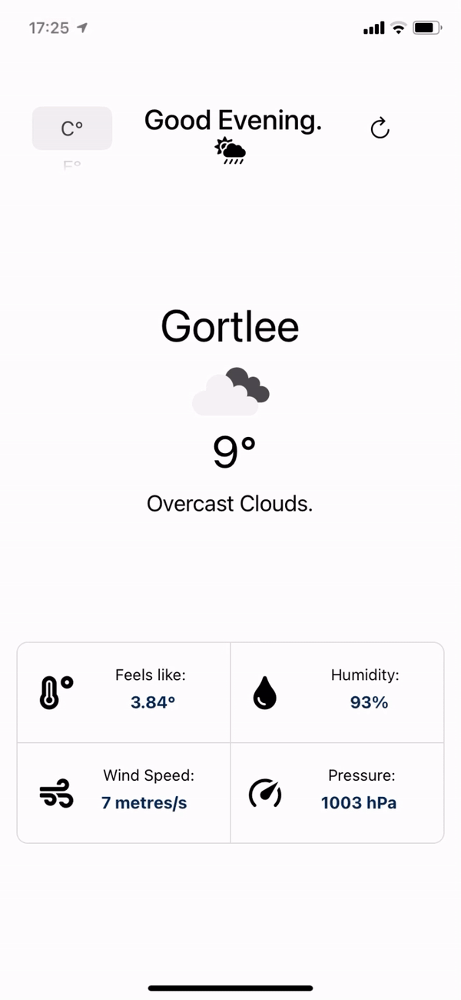

# <h1 align="center">A Weather-App</h1>
<h2 align="center">By Prathamesh Sai</h2>

<h3 align="center">Discover the weather.</h3>

This is a simple weather app for IOS with an aesthetically pleasing UI, showing the weather details for the user based on their location.    The temperature can be shown in either °C (Celsius) or °F (Fahrenheit) based on the user's preferences by toggling the picker.    The app will greet you with "Good Morning", "Good Evening", or "Good Night" based on the local time of the user.

The app displays important weather details such as the temperature, a short description of the weather, what the weather feels like with human perception, the humidity, the wind speed (in both metres/second and miles/hour based on whether the user prefers the metric system or the  imperial system), and the pressure in hPa (hectopascals). 

The user can refresh the page by pressing the refresh button to update the weather details being shown.

<h3 align="center">How it works.</h3>

This application was made with React Native and Expo. It uses <a href="https://openweathermap.org/api">OpenWeatherMap's API</a> to retrieve weather details for user's around the world. By making a series of API calls, this appliction can quickly and efficiently gather weather information and display it in an elegant manner to the user.

This application was developed with Expo Cli for Windows, Visual Studio Code, and the Expo Go app on the  iPhone XR. 

